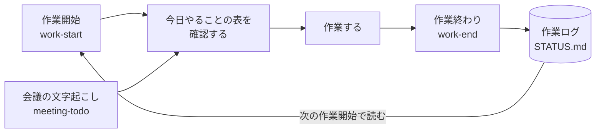

# タスク整理スキル

**作業の始め・終わり・会議のあとに、いま抱えているタスクを確認して整理するための Claude Code のスキル集です。**

## こんな困りごとを解決します

いくつかの作業を並行していると、「前回どこまで進んだか」「会議で何を頼まれたか」「他の人が何を変えたか」が抜けやすくなります。
このスキルでは、Claude が記録を読み直して、やることを優先順位の順に表にまとめます。その表を自分で確認し、順番や進め方を決めてから作業に入る流れです。

| これまで | このスキルを入れると |
|---|---|
| 前回の続きを思い出すところから始まる | 作業ログと前回のリストから、残っているタスクが表に並ぶ |
| 会議の宿題が議事録に埋もれる | 文字起こしの全文から、誰が何をいつまでにやるかが抜き出される |
| 他の人の変更に気づかず作業を始めてしまう | 作業開始時と記録のコミット時に、Git の状態を確かめる |
| 何から手をつけるか毎回迷う | 「人が待っている」「期限が近い」などの基準で並んだ順番を見て決められる |
| 進め方の認識が途中でずれる | タスクごとに「進め方・完了条件・迷っている点」を先に書いて確認できる |

## 入っているもの

| スキル | 呼び方の例 | やること |
|---|---|---|
| `work-start` | 「作業開始」「今日やること」「前回の続き」 | ステータス・作業ログ・前回のリスト・新着ファイル・Git の状態を読み、今日やることを表にする |
| `work-end` | 「作業終わり」 | やったこと・決まったこと・次にやることを作業ログに残し、ステータスとリストを最新にして、Git にコミットする |
| `meeting-todo` | 文字起こしを貼る／「議事録読んで」 | 全文からやることを抜き出し、表にする |

3つとも同じ表の形（`.claude/shared/やることリストの型.md`）を使います。入口が違うだけで、出てくるリストは同じ形です。

出てくる表の例:

| 順位 | やること | どういうこと？（かんたん説明） | 担当 | 期限 | 誰のため | かかりそうな時間 | 状態 |
|---|---|---|---|---|---|---|---|
| 1 | 〇〇さんの変更を取り込む | 前回のあとに3件の変更が足されている。今日触るファイルと重なるので先に合わせる | Claude | 今日 | 自分 | 10分 | 未 |
| 2 | 会議資料の数字を直す | 先週の会議で頼まれた分。月曜に使うので先にやる | 自分＋Claude | 9/15 | 〇〇さん | 30分 | 未 |
| 3 | 資料を〇〇さんに送る | 数字を直したあとに送る | 自分 | 9/15 | 〇〇さん | 5分 | 未 |

「担当」で、自分がやること（連絡・判断・送信など）と、Claude が手伝う作業を分けています。

## 流れ

`work-end` が残した記録を、次の `work-start` が読む、という繰り返しです。



- **work-start**：記録を読む → 表を出す → 確認してから始める
- **work-end**：やったことを記録に書く → Git にコミット
- **meeting-todo**：会議のあとに、文字起こしから同じ形の表を出す

## 使い方

### 1. 置く

このリポジトリの `.claude/` フォルダの中身（`skills/` と `shared/`）を、次のどちらかに置きます。

| 置き場所 | 使える範囲 | こんなときに |
|---|---|---|
| 作業フォルダの中の `.claude/` | そのフォルダで Claude Code を開いたときだけ | 仕事用のフォルダだけで使いたい |
| 自分のホームの `.claude/`（Windows は `C:\Users\<ユーザー名>\.claude\`、Mac は `~/.claude/`） | どのフォルダでも使える | いつでも使いたい |

すでに `.claude/` がある場合は、`skills/` と `shared/` の中身だけ足してください。
どちらに置いても、記録（STATUS.md や作業ログ）は Claude Code を開いた作業フォルダにできます。

### 2. 前提を決める

記録の置き場所や Git の使い方は、`.claude/shared/前提.md` の1か所にまとめています。3つのスキルはすべてここを読みます。

| 項目 | 最初の値 |
|---|---|
| ステータスファイル | `STATUS.md` |
| 作業ログ | `作業ログ/` |
| やることリスト | `やることリスト/` |
| 文字起こしの保存先 | `やることリスト/文字起こし/` |
| 新着を見るフォルダ | `inbox/` |
| Git を使うか | 使う |
| Git の作業ブランチ | `main` |
| 記録を push するか | しない |

そのままでも使えます。Git を使っていなければ「Git を使うか」を「使わない」に、チームで記録を共有するなら「記録を push するか」を「する」に変えてください。

### 3. はじめての1回目

まだ記録が無いので、1回目だけ流れが少し違います。

1. 作業フォルダで Claude Code を開き、「作業開始」と話しかける
2. 記録が無いので、「いま抱えている作業」を聞かれる。作業名・期限・誰のためか・どこまで進んだかをまとめて答える
3. 今日やることの表が出るので、順番と進め方を確認する。確認すると `STATUS.md` が作られる
4. 作業の終わりに「作業終わり」と言う。`作業ログ/` に今日の記録が書かれる

2回目からは、「作業開始」で前回の続きが表になります。
`STATUS.md` と作業ログの見本は `.claude/shared/見本/` にあります。

## 必要なもの

| 必要なもの | 補足 |
|---|---|
| Claude Code | スキルを読み込める環境 |
| Git | 任意。使っていなければ前提で「使わない」にする |
| 費用 | スキル自体にはかかりません |

## 気をつけること

- **確認が取れるまで、表の作業には手を付けない作り**です。表を見て、順番や進め方が違えばその場で直してください
- 作業開始時の Git の確認では、共有先の情報を取ってくる（`git fetch`）だけで、手元のファイルやブランチは変えません
- 作業終わりのコミットは、記録のファイル（STATUS.md・作業ログ・やることリスト）だけです。ほかの変更には触りません。いまのブランチが前提の作業ブランチと違うときは、コミットせずに止まります
- 記録を push する設定でも、記録以外の変更が残っているときは送らずに止まります（記録のコミットは手元に残るので、次の作業終わりで一緒に送れます）
- 作業ログは消さずに追記していく方式です

### Git の言葉

| 言葉 | 意味 |
|---|---|
| リモート（共有先） | GitHub など、チームで変更履歴を共有している場所 |
| fetch | 共有先の最新の情報を取ってくる。手元のファイルは変わらない |
| pull | 共有先の変更を手元に取り込む |
| commit | 手元で変更を記録する |
| push | 手元の記録を共有先に送る |

## ファイルの構成

```
.claude/
├── skills/
│   ├── work-start/SKILL.md      作業開始
│   ├── work-end/SKILL.md        作業終わり
│   └── meeting-todo/SKILL.md    会議の文字起こしから
└── shared/
    ├── 前提.md                   記録の置き場所・Git の使い方（ここだけ書き換える）
    ├── やることリストの型.md      3つで使う表の形・優先順位のつけ方
    └── 見本/
        ├── STATUS.md             ステータスファイルの見本
        └── 作業ログ/YYYY-MM-DD.md  作業ログの見本
```

使い始めると、作業フォルダに次のファイルができていきます。

```
STATUS.md                                    いま進めている作業と次にやること
作業ログ/2026-09-15.md                        日付ごとの記録（work-end が書く）
やることリスト/やることリスト_2026-09-15.md    その日の表（work-start・meeting-todo が書く）
やることリスト/文字起こし/                     チャットに貼った文字起こしの控え
```

## なぜこの形にしているか

- **最初に確認をまとめる**：作業の途中で何度も確認を挟むより、始める前に進め方と完了条件をそろえておくほうが、やり直しが少なくなりました
- **記録はファイルに残す**：会話はあとから追いにくいので、作業ログとステータスに書き出し、次の作業開始時に読み直します
- **Git は作業の前と記録の前に見る**：同じリポジトリを複数人で触っていると、相手の変更に気づかないまま作業を進めてしまうことがあったためです

出所：自分の作業環境で使っているスキルから、個人の設定を外して共有用にまとめたものです。
